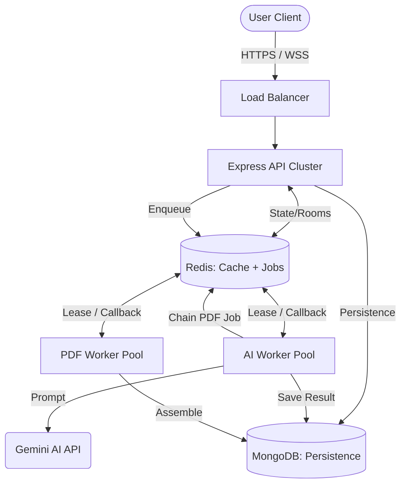

# VedaAI Architecture: Top 1% Engineering Standards

## High-Level Overview

VedaAI is designed as an **event-driven, horizontally scalable micro-monolith**. It leverages decoupled workers and a central Redis-backed orchestration layer to handle resource-heavy AI and PDF generation tasks without impacting API responsiveness.

## Key Architectural Patterns

### 1. Dependency Injection (DI)
The system uses manual constructor-based injection for all Services and Repositories. This ensures:
- **Testability**: Dependencies can be easily mocked in Vitest.
- **Decoupling**: Business logic isn't tied to specific library instances (e.g., `geminiModel`).

### 2. Multi-Tiered Caching
- **Persistence**: MongoDB for long-term storage.
- **Cache**: Redis Layer (`CacheService`) used to serve hot data (active assignments) with automatic invalidation on job completion.

### 3. Resilient Queue Pipeline
Using BullMQ, the generation process is split into two specialized stages:
- **Stage 1 (AI Generation)**: High-latency, external API dependent. Uses exponential backoff and 5 retry attempts.
- **Stage 2 (PDF Assembly)**: CPU-bound, local asset generation. Triggered only after Stage 1 success.

### 4. Real-Time Observability
- **Request Tracing**: Every transaction is assigned a `X-Request-ID` UUID, propagated from the API to the background workers for 1:1 log correlation.
- **Socket.IO Rooms**: Granular event streaming allowing clients to subscribe only to relevant assignment updates.

## Scalability Strategy
1. **Vertical**: Increase BullMQ `concurrency` in worker settings.
2. **Horizontal**: 
   - Deploy multiple instances of the `API` process.
   - Deploy multiple counts of the `Worker` process.
   - All shared state is stored in `Redis` (using the `@socket.io/redis-adapter` and BullMQ's native Redis integration).
